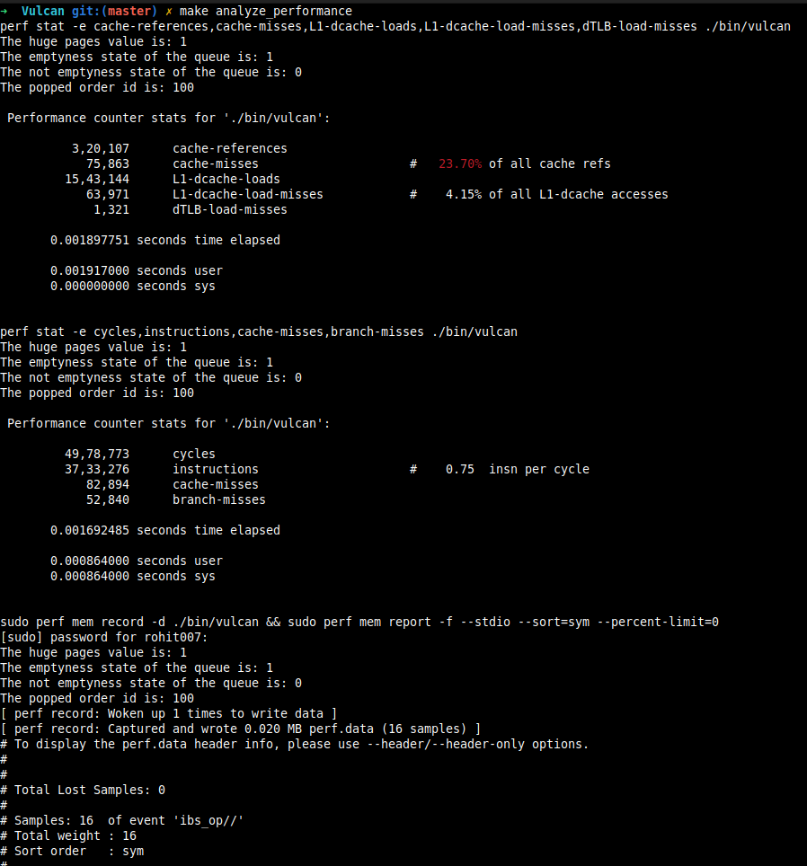

# Vulcan
A Low-Latency Trading Engine (Tick-to-Trade system) built from ground up to run on Linux and specific AMD Ryzen 5600H. It acts as a 
deterministic pipeline. On completion, Vulcan will do 4 specific tasks:

1. **Feed Arbitration**: Receiving multiple copies of market data (UDP) and picking the fastest one using Zero-Copy techniques
2. **LOB (Limit Order Book) Management**: Maintaining a real-time map of every "Buy" and "Sell" order in the market with O(1) complexity
3. **Risk Checking**: Validating that a trade won't bankrupt the firm in under 100 nanoseconds.
4. **Order Entry**: Formatting a "Buy" or "Sell" instruction into a binary protocol (like FIX/SBE) and blasting it back to the exchange.

Commands to test the Engine(the order of commands is to be always maintained):
1. **make clean** - to start fresh from beginning
2. **make** - build
3. **make run_tests** - run the tests
4. **make analyze_performance** - get performance report on terminal
5. **make machine** - get disassembler to produce machine code

To test performance, from the root directory - type these commands in the terminal
1. **perf stat -e cycles,instructions,cache-misses,branch-misses ./bin/vulcan**
2. **perf stat -e cache-references,cache-misses,L1-dcache-loads,L1-dcache-load-misses ./bin/vulcan**

To find the error using a degugger, use these commands and maintain the ordering:
1. **make clean**
2. **make find_error**
3. **run** - if successfully entered the GDB Shell
4. **backtrace**

Currently working on:
1. **Lock-free SPSC circular Queue**
This Queue stores QueueOrder instances inside it upto a certain capacity. Its created inside the pre-allocated memory directly using placement new in static factory method. It contains 2 member variables 
(one for each thread - producer and consumer) with each of the member variables aligned according to 64-bytes for preventing False Sharing. A single Huge Page (2mb size) allocation had been made using the build
script first for the pre-allocated memory.

Filling the entire allocated block (2 mb) of a Huge Page with the byte value: 0x00 for deterministic warming of scope and value. 
To solve **problem number 4**, 4 steps need to be taken - Modifying GRUB config -> Declaring Pool size -> Committing and Persistent Pinning -> Verification. Appending **hugepages=16** to **GRUB_CMDLINE_LINUX_DEFAULT**
in **/etc/default/grub** file, updating the GRUB bootloader and then rebooting.

Splitting the monolithic pop function and implementing the **Pinning Pattern** by splitting the operation into 2 phases: **Access** and **Release**

Current performance analysis:

Current problems:
1. My AMD Zen 3 has L1 Data Cache per core of 32 kb. So, if I create the SPSC Queue with 1024 capacity, so the memory needed to store the QueueOrders = 1024 * 64 = 64 kb, which is more than L1 cache
  capacity. So, reducing the capacity to 256 since now the memory required = 16 kb and the assertion that capacity should be a power of 2 is also satisfied. (Solved)
2. The calling of memset(obj, 0x00, sizeof(*obj)) is a "Cold Path" solution but inefficient. While it warms the physical memory, but doesn't address the Store-To-Load Forwarding conflicts that
   can occur when transitioning from initializing buffer to high-speed matching loop
3. Replacing the memset function call in create function with Non-Temporal Store intrinsics (e.g., _mm_stream_si128), but facing a C++ type-safety violation. (solved)
4. Currently facing Physical Memory Fragmentation (mmap stops working suddenly even when I have a huge page allocated successfully). This problem was resolved the last time I rebooted the system. Issue:
   In the AMD Zen 3 architecture, a 2MB Huge Page is not just a size requirement; it is a contiguity requirement. The MMU requires 512 consecutive 4KB physical page frames to back a single huge page. As my 
   Ubuntu system runs, user-space processes and kernel administrative tasks scatter 4KB allocations across the DRAM, leaving no 2MB gaps of contiguous space. (solved)
5. A single pop function to pop Orders from Queue is proving to be a Latency trap. Because in such a case of returning the **const pointer** - the function execution ends, but I am still yet to update the head.
   If I update the index before the consumer has finished processing the order, it would lead to a **Write After Read** hazard where the Producer core (potentially on another physical core in the same CCD) sees the
   vacant slot, overwrites it and corrupts the data while the Consumer thread is still reading the price. 