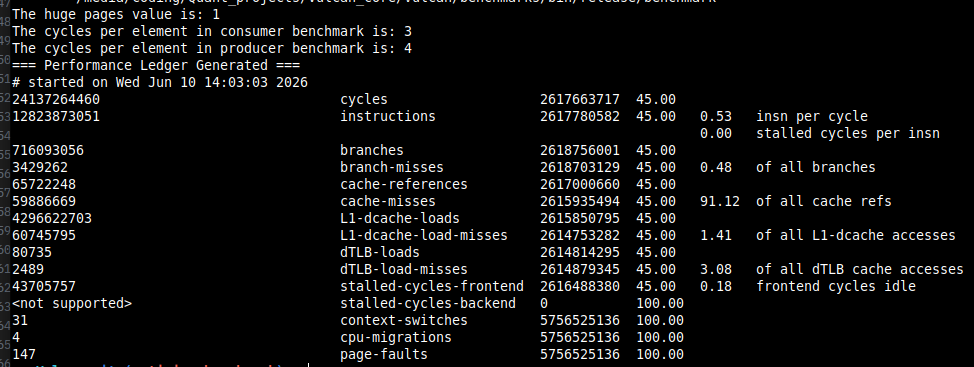
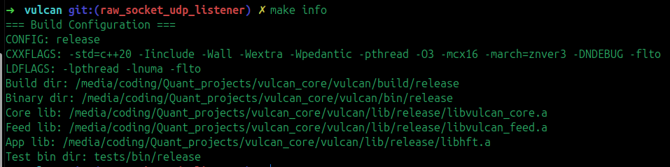
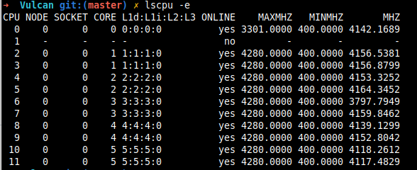
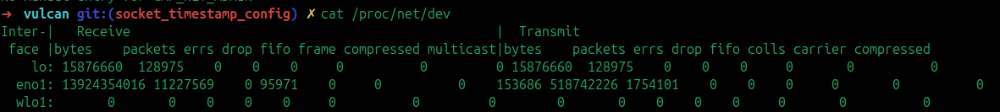
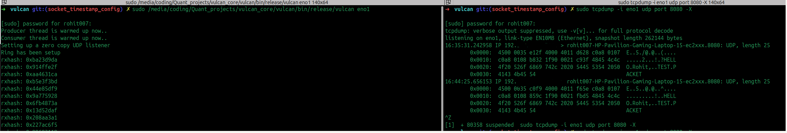
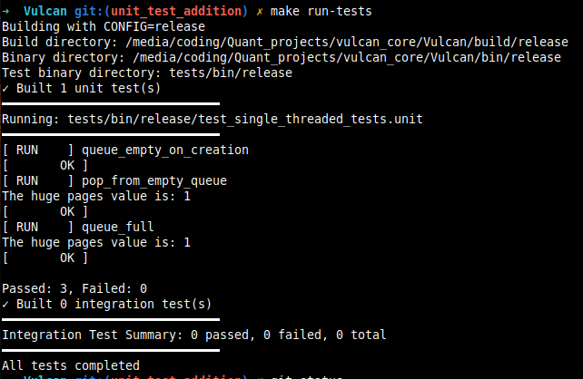
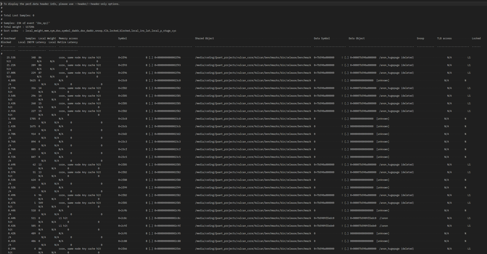
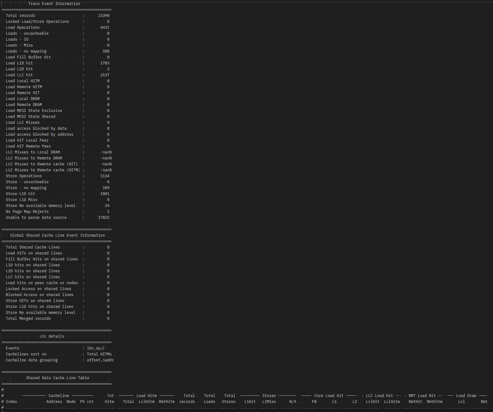

# Vulcan
A Low-Latency Trading Engine (Tick-to-Trade system) built from ground up to run on Linux and specific AMD Ryzen 5600H. It acts as a deterministic pipeline with integrated with **Raw Socket Zero-Copy UDP Listener**. 
On completion, Vulcan will do 4 specific tasks:

1. **Feed Arbitration**: Receiving multiple copies of market data (UDP) and picking the fastest one using Zero-Copy techniques
2. **LOB (Limit Order Book) Management**: Maintaining a real-time map of every "Buy" and "Sell" order in the market with O(1) complexity
3. **Risk Checking**: Validating that a trade won't bankrupt the firm in under 100 nanoseconds.
4. **Order Entry**: Formatting a "Buy" or "Sell" instruction into a binary protocol (like FIX/SBE) and blasting it back to the exchange.

**Performance Highlights for the benchmark**
1. **Stalled cycles per instruction** = 0.00
2. **Cycles per element in Consumer thread** = 3
3. **Cycles per element in Producer thread** = 4
4. **Frontend cycles idle** = 0.20

Current benchmark performance: The number of **Cycles per element in Consumer thread** = **3** and **Cycles per element in Producer thread** = **4**

Currently working on:
1. **Lock-free SPSC circular Queue**
This Queue stores QueueOrder instances inside it upto a certain capacity. Its created inside the pre-allocated memory directly using placement new in static factory method. It contains 2 member variables 
(one for each thread - producer and consumer) with each of the member variables aligned according to 64-bytes for preventing False Sharing. A single Huge Page (2mb size) allocation had been made using the build
script first for the pre-allocated memory.

Filling the entire allocated block (2 mb) of a Huge Page with the byte value: 0x00 for deterministic warming of scope and value. 
To solve **problem number 4**, 4 steps need to be taken - Modifying GRUB config -> Declaring Pool size -> Committing and Persistent Pinning -> Verification. Appending **hugepages=16** to **GRUB_CMDLINE_LINUX_DEFAULT**
in **/etc/default/grub** file, updating the GRUB bootloader and then rebooting.

Splitting the monolithic pop function and implementing the **Pinning Pattern** by splitting the operation into 2 phases: **Access** and **Release**

For performance optimization, pinning producer and consumer threads to **Cores 0 and 2** respectively and **Turning Off CPU 1 (offline)** by running the environment hardening script from terminal.

Using **native_handle()** for **Thread Management with CPU Affinity** (Pinning a thread to a specific CPU core). Hardware Architecture varies drastically between different OS and require native_handle() to bypass the 
C++ abstraction and speak directly to the OS Kernel. So, to pin a thread  - we must pass the OS specific thread identifier directly to the Kernel API's and since (Windows and Linux) handle CPU scheduling differently,
we need to use the native handle of the OS.

2. **Raw Socket Zero-copy UDP Listener** utilizing mmap'd ring buffers to completely bypass recvfrom data copies

How to test if the Server is working:
  a) Open the terminal and cd to the root directory -> enter the following commands in order
  b) **make clean** -> **make all** -> **make run** -> The server is running now. 
  c) Open another terminal on the same machine and in the same directory location -> enter **echo "Hello" | nc -u -w1 localhost 8080** -> **Hello** will be printed to the next line (f nc is not available, install ncat using: **sudo apt install ncat** on Ubuntu)
  
This project uses a dedicated Ethernet cable instead of a generic wifi connection to improve latency, packet transfer success rates and to reduce jittering. So, the Zero-Copy UDP Listener will be using **eno1** in this case.

**How I tested the Raw socket UDP Listener**:
- Build and run the project with the correct permissions (need sudo for this)
- In the machine running Vulcan, opening another terminal window to check the tcpdump logs
- Used a separate computer (Ubuntu) and used netcat from the terminal to send packets to the machine running the project Vulcan (using the host device's ip address and port number)
- The logs appear in the tcpdump terminal window and the RX hashes appear in the application terminal window
- The picture underneath shows how it looks:

**current status**
The zero-copy UDP listener is working perfectly. The rxhash values we're seeing are the packet hashes from the kernel's receive flow, and the constant stream of hashes demonstrates that our application is successfully receiving and processing UDP packets in a tight loop. The rxhash: 0x... values — These are the kernel's RSS hash for each received packet. 

**Current problem**:
The constant stream of rxhash prints means your application is polling the socket in a tight loop and printing the hash for every poll attempt, not just when a packet arrives. The repeating values suggest:
  - We're using recvfrom() or recvmmsg() in a loop, and the kernel is returning the same packet or status repeatedly
  - We're reading from the ring buffer without advancing the consumer index (same bug pattern as your SPSC queue earlier!)
  - The same packet is being delivered multiple times because the receive queue isn't being drained properly
    
**Next focus on solving this problem**:
  - Advancing the consumer/read index after processing each packet
  - Only printing when a new packet arrives (track sequence numbers or compare timestamps)
  - Verifying the actual payload is received correctly

The repeating rxhash values (especially 0x74ad68d appearing 4 times consecutively) strongly suggests you're re-reading the same packet from the ring buffer without advancing the read pointer.

The tcpdump confirms the packet was sent and received correctly on port 8080

**Running tests**
Tests (Unit + Integration tests) can be run in the terminal from the root directory using the commands given in the below table. All test files will be stored in the tests/ directory.

**Benchmarking**:
For measuring benchmarks performance, building a separate benchmark executable with different Makefile command. For the benchmark, creating 2 threads: Producer and consumer (pinned to different cores) which are supposed to run for 100M times. Producer pushes QueueOrder instances to the SPSC Queue and the consumer thread pops it. Storing 8 instances of QueueOrders in a array on the stack and using the Producer thread to take instance from it and push to the queue. Instances capacity is chosen as 8 such that the total space needed = 8 * 64 bytes and it can sit comfortably sit inside the L1-D cache of my processor, avoiding the overflow problem. 

Upon creation of the Producer thread, its first pinned to a particular core and it waits for until m_start turns true. An array of 8 QueueOrders is then allocated on the stack to hold instances which will then be pushed to the queue. Then finally when m_start turns True, the Queue is warmed up in Producer thread using 1M push operations and a memory fence is established. The thread finally enters the hot path and starts pushing QueueOrder instances into the queue. It will be in a spin-wait for as long as the Queue is full and only push 8 instances when there is space to do so together. For the Push operation, there is no allocation involved (using Placement new to create the instance directly inside the pre-allocated memory buffer). Replacing the normal single release of atomic tail after every successful push with batched release of 8. After 1B iterations, producer thread exits the hot loop, memory fence is closed and the cycles per element in tbe Producer thread is calculated.  

Same like Producer thread, the Consumer thread is first pinned to a core and then waits for m_start to turn true. When it turns True, its warmed up first with 1M burst. A memory fence is established and it enters the hot loop for 1B iterations.   The Consumer thread will also be in a spin-wait for as long as the Queue is empty and only start with the pop operation when 8 instances are present in the queue. When the condition is satisfied, it takes a peek at it and gets the memory address of the 8 QueueOrder instance which are to be popped. To avoid compiler optimizaton, from the pointer to the QueueOrder instance obtained, it accesses the price field and adds it to the local register accumulators (to make it seem like we are doing something with the pointer) and this is done for every single iteration. Again like Producer thread, there is a batched release of atomic head when count is 8. After the hot loop exit, Memory fence gets closed and the cycles per element is calculated in Consumer thread.

Benchmark **Latency report snippet** with 1 billion iterations in the Lock-free SPSC Queue:

Perf defines **cache references** as requests that have already escaped the L1/L2 layers. So, the **cache misses** metric in the benchmark performance image is 89.45% of escaped references and not the total memory accesses. 

Why is the Queue missing the Last Level Cache 60 million times? Because of the MESI Cache Coherency Protocol - its processing 1 Billion elements by batching them in strides of 8. So, 1B / 8 = 125M coherency publications across the Infinity Fabric. Every time Core 0 publishes the tail, it issues a Request-For-Ownership (RFO), marking the cache line as Modified (M) and violently invalidating it in Core 2. When Core 2 attempts to read the new batch, the data is physically absent from its local hierarchy. It must miss. Our ~60 million cache misses correlate precisely with the Infinity Fabric coherency strikes required to route the data.

Our IPC is **0.53** because your **pipeline is spending a massive amount of time executing the _mm_pause() intrinsic inside our spin-wait**. _mm_pause() intentionally halts the instruction fetch and decode frontend to prevent speculative execution from consuming power and polluting the L1 while waiting for the MESI RFO response. A low IPC during a lockstep spin-wait means our execution units are perfectly resting, completely starved of branch mispredictions and junk data.

The **perf C2C report for the benchmark Lock-Free SPSC Queue** with 1 Billion iterations:

**Networking**
Since we are prioritizing the lowest possible latency, so we would be using AF_PACKET instead of AF_INET. 
To avoid additional latency overhead due to interrupts and context switches - we are prepared to accept the tradeoff with the cost of higher CPU utilization using Busy Polling on our sockets. As per this technique, when the application asks for more date and there is none in the socket queuem 
the networking stack actively calls into the device driver - driver checks for newly arrived data and pushes it through the network (L3) layer to the socket. Driver may find data for other sockets and will push that data as well. When poll call returns to the networking stack, the socket code checks whether new data is pending on the socket receive queue. We would be using **Enabling per socket** for this project instead of **Enabling Globally**

**Current problems**:
1. My AMD Zen 3 has L1 Data Cache per core of 32 kb. So, if I create the SPSC Queue with 1024 capacity, so the memory needed to store the QueueOrders = 1024 * 64 = 64 kb, which is more than L1 cache capacity. So, reducing the capacity to 256 since now the memory required = 16 kb and the assertion that capacity should be a power of 2 is also satisfied. (Solved)
2. The calling of memset(obj, 0x00, sizeof(*obj)) is a "Cold Path" solution but inefficient. While it warms the physical memory, but doesn't address the Store-To-Load Forwarding conflicts that can occur when transitioning from initializing buffer to high-speed matching loop (solved)
3. Replacing the memset function call in create function with Non-Temporal Store intrinsics (e.g., _mm_stream_si128), but facing a C++ type-safety violation. (solved)
4. Currently facing Physical Memory Fragmentation (mmap stops working suddenly even when I have a huge page allocated successfully). This problem was resolved the last time I rebooted the system. Issue:
   In the AMD Zen 3 architecture, a 2MB Huge Page is not just a size requirement; it is a contiguity requirement. The MMU requires 512 consecutive 4KB physical page frames to back a single huge page. As my 
   Ubuntu system runs, user-space processes and kernel administrative tasks scatter 4KB allocations across the DRAM, leaving no 2MB gaps of contiguous space. (solved)
5. A single pop function to pop Orders from Queue is proving to be a Latency trap. Because in such a case of returning the **const pointer** - the function execution ends, but I am still yet to update the head. If I update the index before the consumer has finished processing the order, it would lead to a **Write After Read** hazard where the Producer core (potentially on another physical core in the same CCD) sees the vacant slot, overwrites it and corrupts the data while the Consumer thread is still reading the price. (solved)
6. Hardware NUMA Pinning - need to use (numactl --membind) as in case of multi-socket architecture, physical memory access costs vary depending on the node and destroy deterministic behaviour
7. In benchmarks, cycles per element in producer and consumer thread is 17. We need to decrease it further into single-digit numbers. Instructions per cycle = 0.28 (needs to be 1.5+). Branch misses = 1.28% currently, needs to be decreased further (partially solved, now the **cycles per element in both threads is 6**)
8. About pinning threads to particular cores (pinning producer thread to CPU 0 Core 0 and consumer thread to CPU 2 Core 1), we have to ensure that the CPU's lie on the same Core Chiplet Die (CCD). Since our threads are pinned to CPU 0 and 2 - they always lie on the same CCD in **AMD RYZEN 5000** chips (Solved) - In the 'Zen 3' architecture used for this generation, each CCD contains 8 cores, and the logical-to-physical core mapping assigns Core 0, 1, 2, 3, 4, 5, 6, and 7 sequentially to the first CCD (CCD #0).
9. For Deterministic Memory binding, I'll have to use mbind which is included in the **numaif.h file** and it needs to be included in the benchmark file. Before that, I'll have to install the dependency on my machine using the command: **sudo apt install libnuma-dev**. Once its installed, then only I can use it in my program. (solved)
10. In single threaded unit-tests like suppose pop from an empty queue, the thread will be stuck in a spin-wait situation till there is an element pushed into the queue which can be popped. So, when pop operation spin-waits on empty, we cannot test it in a purely single-threaded, sequential fashion because the test itself would deadlock. (Solved) - By introducing controlled concurrency - Dual Thread minimal test (design minimal deterministic test harness) implemented by a separate consumer thread function.
11. For a Zero-copy UDP Listener, I would need to achieve Kernel-bypass natively within the Linux Ecosystem using PF_PACKET. Using PACKET_MMAP for efficiency, as it provides a size configurable circular buffer mapped in user space that can be used to either send or receive packets. This way reading packets just needs to wait for them, most of the time there is no need to issue a single system call. Since we would be capturing at high-speeds, checking if device driver of my NIC supports NAPI and making sure its enabled. Creating a Bash script for all this (done)
12. My current device driver in NIC is Realtek Wi-Fi 6 driver and it **does not support Threaded NAPI which would be a feature for high-performance Low-Latency Trading environments**. But wifi-drivers don't implement it since wifi packet rates are much lower, driver architecture is much different and the feature wasn't designed for wireless. So, this threaded NAPI can't be enabled by me. (Unsolvable - so leaving this issue for now). Only solvable with future upgrades to hardware: Intel 10GbE NIC + wired Ethernet connection and proper Kernel tuning.   

All commands that Vulcan supports currently:
---

## Build Commands

| Command | Description | Optimizations | Debug Symbols |
|---------|-------------|---------------|----------------|
| `make` or `make all` | Default release build | ✅ Full -O3 | ❌ Stripped |
| `make release` | Explicit release build | ✅ Full -O3 | ❌ Stripped |
| `make debug` | Debug build (no optimizations) | ❌ -O0 | ✅ Full -g3 |
| `make benchmark-config` | Benchmark build (optimized + symbols) | ✅ -O3 | ✅ Minimal -g |
| `make program` | Build only main program (release) | ✅ | ❌ |
| `make library` | Build static library only | Depends on config | Depends on config |
| `make directories` | Create build directories only | N/A | N/A |
| `make config=debug` | Build everything in debug mode | N/A | N/A |
| `make config=benchmark` | Build everything in benchmark mode | N/A | N/A |
| `make core-library` | Build only the core library (lib/release/libvulcan_core.a) | N/A | N/A |
| `make feed-library` | Build only the feed library (lib/release/libvulcan_feed.a) | N/A | N/A |

---

##  Utility Commands

| Command | Description |
|---------|-------------|
| `make info` | Show current configuration and available targets |
| `make benchmark-link` | Create convenience symlink `./benchmark` |
| `make format` | Format all C++ source/headers with `clang-format` |

---

##  Clean Commands

| Command | Description |
|---------|-------------|
| `make clean` | Clean everything (all builds, benchmarks, symlinks) |
| `make clean-release` | Clean only release build |
| `make clean-debug` | Clean only debug build |
| `make clean-benchmark` | Clean benchmark results only |
| `make clean-all` | Same as `clean` |
| `make clean-tests` | Clean test binaries |
| `make run-unit-tests` | Run unit tests only | N/A | N/A |
| `make run-integration-tests` | Run integration tests only | N/A | N/A |

---

##  Test Commands

| Command | Description |
|---------|-------------|
| `make tests` | Build all tests (release) |
| `make run-tests` | Run all tests (release) |
| `make unit-tests` | Build all unit tests |
| `make integration-tests` | Build all integration tests |
| `make run-test TEST=test_queue` | Run specific test by name (replace test_queue with the name of the actual test) |
| `make debug-tests` | Debug build (follow it up by running specific tests by name) |
| `make clean-tests` | Clean test artifacts only |
| `make clean` | Full clean (including tests) |

---

##  Debug Commands

| Command | Description | Binary |
|---------|-------------|--------|
| `make find_benchmark_error` | GDB backtrace on benchmark | Benchmark (current config) |
| `make find_error` | GDB backtrace on main program | `vulcan` |
| `make machine` | Disassemble `main.o` | Object file |

---

##  Performance Analysis Commands

| Command | Description | Target Binary |
|---------|-------------|----------------|
| `make analyze_benchmark_performance` | Full perf analysis (cache, CPU, memory) | Benchmark |
| `make check_benchmark_latency` | Latency and cache‑coherence analysis | Benchmark |
| `make analyze_performance` | Full perf analysis | Main program (`vulcan`) |
| `make analyze_test_performance` | Perf analysis | Test runner |
| `make check_latency` | Latency analysis | Main program |
| `make debug-analyze` | Perf analysis on debug benchmark | Debug benchmark |
| `make valgrind` | Run the main binary under Valgrind (leak checking) |
| `make valgrind-benchmark` | Run benchmark under Valgrind |

---

##  Run Commands

| Command | Description | Binary Used |
|---------|-------------|--------------|
| `make run` | Run main production binary | `bin/release/vulcan` |
| `make run_benchmark` | Run benchmark (release default) | `benchmarks/bin/release/benchmark` |
| `make debug-run` | Run debug benchmark | `benchmarks/bin/debug/benchmark` |
| `make release-run` | Run release benchmark | `benchmarks/bin/release/benchmark` |
| `make benchmark-run` | Run benchmark‑config build | `benchmarks/bin/benchmark/benchmark` |

---

##  Benchmark‑Specific Build Commands

| Command | Description | Config Used |
|---------|-------------|--------------|
| `make benchmark` | Build benchmark (release default) | release |
| `make debug-benchmark` | Build benchmark with debug symbols | debug |
| `make release-benchmark` | Build benchmark with optimizations (no symbols) | release |
| `make benchmark-config` | Build benchmark optimized + symbols for perf | benchmark |
| `make benchmark-link` | Create `./benchmark` symlink to current config binary | Current |

---
