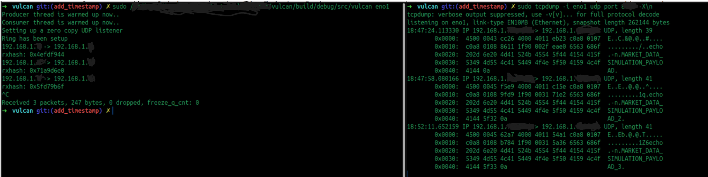
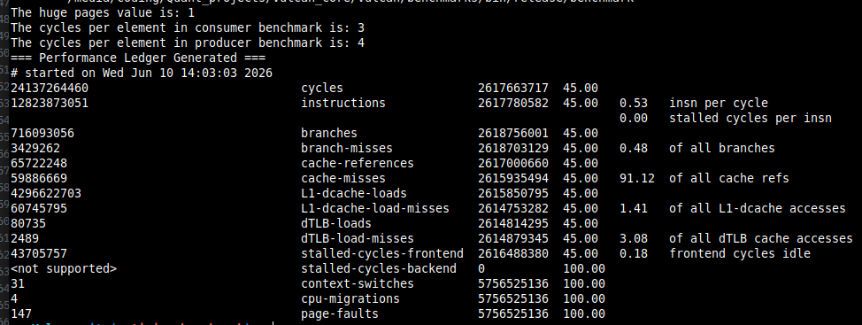

# Vulcan

A Low-Latency Trading Engine (Tick-to-Trade system) built from the ground up to run on Linux and a specific AMD Ryzen 5600H. It acts as a deterministic pipeline integrated with a **Raw Socket Zero-Copy UDP Listener**.

On completion, Vulcan will perform 4 core tasks:

1. **Feed Arbitration** — receiving multiple copies of market data (UDP) and picking the fastest one using zero-copy techniques
2. **LOB (Limit Order Book) Management** — maintaining a real-time map of every buy/sell order in the market with O(1) complexity
3. **Risk Checking** — validating that a trade won't bankrupt the firm in under 100 nanoseconds
4. **Order Entry** — formatting a buy/sell instruction into a binary protocol (like FIX/SBE) and sending it back to the exchange



For the current state of development and open problems, see `Roadmap_and_Challenges.md`. For implementation details and benchmarking methodology, see `Technical_Documentation.md`.

---

## Performance Highlights (current benchmark)

| Metric | Value |
|---|---|
| Stalled cycles per instruction | 0.00 |
| Cycles per element — Consumer thread | 3 |
| Cycles per element — Producer thread | 4 |
| Frontend cycles idle | 0.20 |



---

## Project Requirements

- GCC 13+ (or Clang 17+) with C++20 support
- CMake 3.25+
- Ninja
- libnuma-dev (Fedora: `numactl-devel`)
- `just` — task runner (Fedora/Ubuntu: `sudo dnf install just` / see just's install docs for apt)
- All requirements can be installed in one command: `sudo apt install cmake ninja-build libnuma-dev gcc g++`

## Quick Start

```
just release  # configure + build a release binary
just test     # configure + build + run the test suite (debug)
just run      # run the built release binary (needs sudo - raw sockets)
```

Run `just --list` to see every available command (build, test, debug tools, performance analysis etc.). A full Build and Debug guide will be uploaded later.

---

## Build Configurations

| Preset | Purpose | Command |
|---------|-------------|--------|
| `debug` | Full symbols, no optimization, assertions live | `just debug` |
| `release` | -O3, LTO, stripped, assertions compiled out | `just release` |
| `benchmark` | Release-level optimization + -march=native, symbols kept, for local profiling | `just bench-build` |

## Testing

| Command | Purpose |
|---------|-------------|
| `just test` | All tests, debug build |
| `just test-one <test_name>` | A single test by name |

> Correctness assertions in tests only fire in debug builds — release compiles out `assert()` via `-DNDEBUG`, so a "passing" release test only means nothing crashed, not that assertions were checked.

## Project Layout

| Directory | Purpose |
|---------|-------------|
| `core/` | Shared primitives (Result/Error types, Fatal handling) |
| `feed/` | Market data feed parsing + raw-socket UDP ingestion |
| `include/` | Header-only components (lock-free SPSC queue) |
| `src/` | Main executable |
| `tests/` | Unit + integration tests (CTest) |
| `benchmarks/` | Standalone benchmark library |
