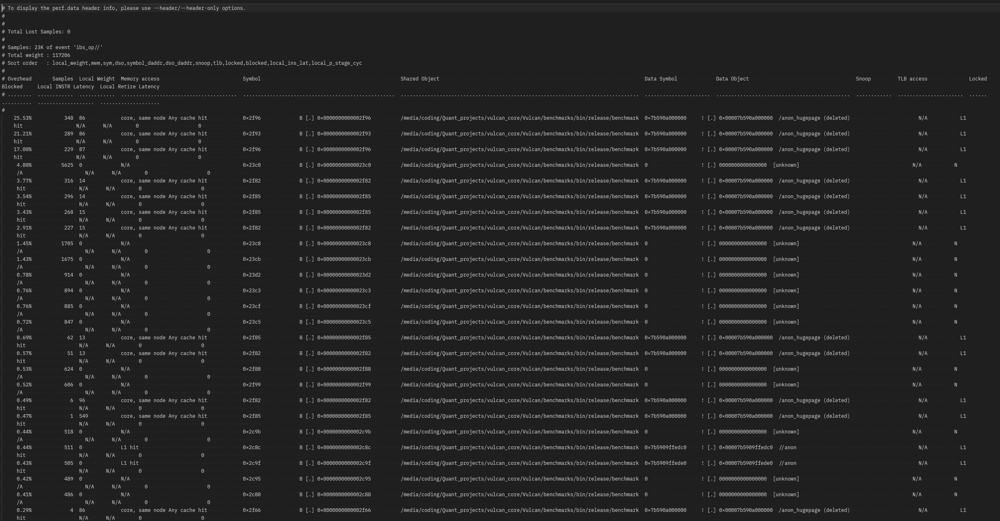
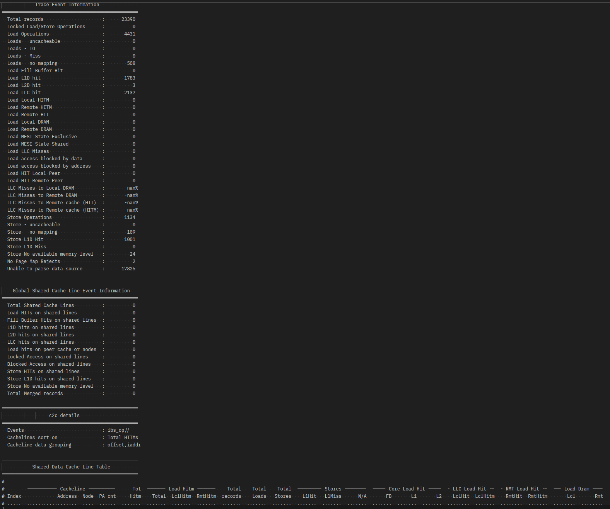
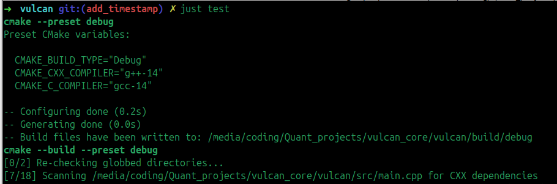

# Vulcan — Technical Documentation

This document covers the implementation details, testing procedure, and benchmarking methodology behind Vulcan's core components. For a high-level overview and build instructions, see `README.md`. For open problems and project history, see `Roadmap_and_Challenges.md`.

---

## 1. Lock-Free SPSC Circular Queue

This queue stores `QueueOrder` instances up to a fixed capacity. It is created inside pre-allocated memory directly using placement `new` in a static factory method. It contains 2 member variables (one for each thread — producer and consumer), each aligned to 64 bytes to prevent False Sharing.

**Memory setup**
- A single Huge Page (2MB) allocation is made via the build script for the pre-allocated memory.
- The entire allocated block is filled with byte value `0x00` for deterministic warming of scope and value.
- Huge Page configuration required 4 steps: Modifying GRUB config → Declaring Pool size → Committing and Persistent Pinning → Verification. This meant appending `hugepages=16` to `GRUB_CMDLINE_LINUX_DEFAULT` in `/etc/default/grub`, updating the bootloader, and rebooting.

**Access/Release pattern**
- The monolithic `pop` function was split into two phases — **Access** and **Release** — to avoid a Write-After-Read hazard: returning a `const` pointer and only later updating the head index meant the Producer (on another core) could see the vacant slot and overwrite it while the Consumer was still reading the price.

**Thread pinning**
- Producer and consumer threads are pinned to Cores 0 and 2 respectively; CPU 1 is turned offline via an environment-hardening script.
- `native_handle()` is used for CPU affinity — hardware scheduling differs across OSes, so pinning requires bypassing the C++ abstraction and passing the OS-specific thread identifier directly to the kernel API.
- On AMD Ryzen 5000 (Zen 3), each CCD contains 8 cores, with logical cores 0–7 mapped sequentially to CCD #0 — so CPU 0 and CPU 2 always share a CCD, keeping inter-core communication fast.

---

## 2. Raw Socket Zero-Copy UDP Listener

Uses `mmap`'d ring buffers to bypass `recvfrom` data copies, plus socket filtering with a Berkeley Packet Filter (BPF).

- Achieves kernel-bypass natively within Linux using `PF_PACKET` and `PACKET_MMAP` — a size-configurable circular buffer mapped into user space for sending/receiving packets, avoiding a syscall on most reads.
- BPF filtering ensures only packets addressed to the correct MAC pass through, via the `SO_ATTACH_FILTER` socket option.
- Requires the NIC driver to support NAPI for high-speed capture.
- Uses a dedicated Ethernet cable (`eno1`) instead of Wi-Fi to improve latency, packet transfer success rate, and reduce jitter.

**How the listener was tested**
1. Build and run the project with sudo (required for raw sockets).
2. On the Vulcan machine, open a second terminal to monitor `tcpdump` logs.
3. From a separate Ubuntu machine, use `netcat` to send packets to Vulcan's host IP/port.
4. Logs appear in the `tcpdump` terminal; RX hashes appear in the application terminal.

**Manual smoke test**
```
make clean && make all && make run
# In a second terminal, same directory:
echo "Hello" | nc -u -w1 localhost 8080
# "Hello" should print in the server terminal
# (install ncat via `sudo apt install ncat` if nc is unavailable)
```

**Current status**: the zero-copy UDP listener is working correctly. The `rxhash` values observed are the kernel's RSS hash for each received packet, and a constant stream of them confirms packets are being received and processed in a tight loop.

---

## 3. Benchmarking Methodology

A separate benchmark executable is built via a dedicated Makefile command. It spins up two threads, Producer and Consumer, pinned to different cores, run for 1 billion iterations.

- The producer pushes `QueueOrder` instances into the SPSC queue; the consumer pops them.
- 8 `QueueOrder` instances are held on the stack at a time (8 × 64 bytes), sized to fit comfortably inside the processor's L1-D cache and avoid overflow.
- Both threads pin to a core and wait for `m_start` to flip true, then warm up with 1M push/pop operations before a memory fence is established and the hot loop begins.
- Pushes use placement `new` directly into the pre-allocated buffer (no allocation), with a **batched release** of the atomic tail every 8 elements instead of releasing after every push.
- The consumer, symmetrically, spin-waits until 8 instances are available, then peeks at their addresses. To defeat compiler optimization, it reads the `price` field from each instance and accumulates it into a local register on every iteration, with a batched release of the atomic head every 8 pops.
- After 1B iterations, each thread exits its hot loop, closes its memory fence, and its cycles-per-element figure is calculated.



### Interpreting the perf results

- `perf` defines **cache references** as requests that have already escaped the L1/L2 layers — so the cache-misses metric (89.45%) is a percentage of *escaped* references, not of total memory accesses.
- The queue misses the Last-Level Cache ~60 million times because of the MESI cache-coherency protocol: processing 1B elements in batches of 8 means 1B / 8 = 125M coherency publications across the Infinity Fabric. Each time Core 0 publishes the tail, it issues a Request-For-Ownership (RFO), marks the cache line Modified, and invalidates it on Core 2 — so when Core 2 reads the new batch, the data is physically absent from its local hierarchy and must miss. The ~60M misses correlate with these coherency strikes.
- IPC of **0.53** reflects time spent executing `_mm_pause()` inside the spin-wait — this intentionally halts instruction fetch/decode to prevent speculative execution from consuming power and polluting L1 while waiting on the MESI RFO response. Low IPC during a lockstep spin-wait means the execution units are resting, not starved by mispredictions or junk work.



---

## 4. Networking

Vulcan prioritizes the lowest possible latency, so it uses `AF_PACKET` instead of `AF_INET`.

To avoid the latency overhead of interrupts and context switches, the project accepts higher CPU utilization in exchange via **Busy Polling** on sockets: when the application requests more data and the socket queue is empty, the networking stack actively calls into the device driver, which checks for newly arrived data and pushes it through the L3 layer to the socket (potentially also pushing data for other sockets it finds). When the poll call returns, the socket code checks whether new data is pending on the receive queue.

Busy polling is configured **per-socket** rather than globally for this project.

---

## 5. Testing

| Command | Purpose |
|---------|-------------|
| `just test` | All tests, debug build |
| `just test-one <test_name>` | A single test by name |

All test files live under `tests/` and run via CTest. Note that release builds compile out `assert()` (`-DNDEBUG`), so a passing release test only confirms nothing crashed — not that correctness assertions held.


